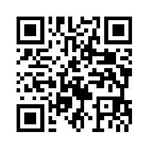

  <picture>
    <source media="(prefers-color-scheme: dark)"  srcset="./assets/im-logo-dark.png">
    <source media="(prefers-color-scheme: light)" srcset="./assets/im-logo-light.png">
    
  </picture>

<h3 align="center">Unlimited Ingenuity</h3>

<em>Reliable industrial-grade memory since 1991.</em>

## About Us

Intelligent Memory has been developing memory products for demanding
industrial applications since 1991. As a German-run memory semiconductor
company, we deliver reliable, long-term-available memory and storage
solutions that let engineers design with confidence.

Every product in our portfolio is engineered to meet the industry's most
demanding requirements for quality, reliability, longevity, and long-term
availability.

## Product Portfolio

| DRAM Components | DRAM Modules | Managed NAND Flash |
|:---:|:---:|:---:|
| Discrete DRAM ICs for custom-designed boards | Ready-to-use DIMM and SO-DIMM modules | NAND flash with integrated controller |

Browse the complete catalog on our [product page](https://www.intelligentmemory.com/) →

## Why Choose Us

- **30+ Years of Industrial Heritage** — Trusted by engineers since 1991.
- **German-Engineered Quality** — Rigorous testing and quality control at every stage.
- **Long-Term Availability** — Multi-year supply commitments aligned with industrial lifecycles.
- **Certified & Traceable** — Full compliance documentation for every product.

## Resources

For datasheets, product catalogs, and technical documentation, please visit
our [official website](https://www.intelligentmemory.com/).

## Connect

**Email:** <info@intelligentmemory.com>

  

